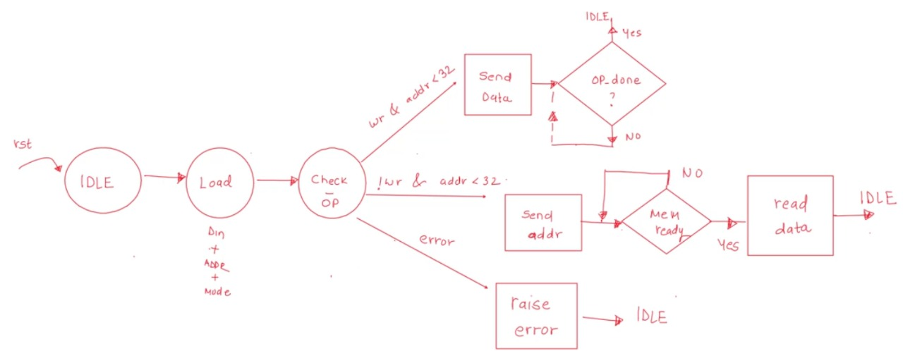

### SPI SPEC
- Inputs:
    - `clk` 
    - `rst`
    - `wr` - 1 - write 0 - read
    - `addr`
    - `din`
    
- Output:
    - `dout`
    - `done`
    - `err`

Assumptions: 
- The memory size is 8 bit words on depth 32.
- Serial peripheral interface (SPI) is synchronous, full duplex main-subnode-based interface

Special Signals
- Chip select (CS)
- master out, slave in (MOSI)
- master in, slave out (MISO)

### Architecture:

### State Diagrams:
Controller

Memory

### Output:

[Link for project on EDA Playground](https://edaplayground.com/x/ZkVb)
