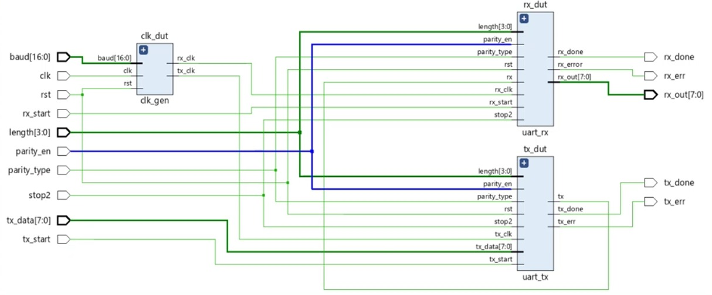
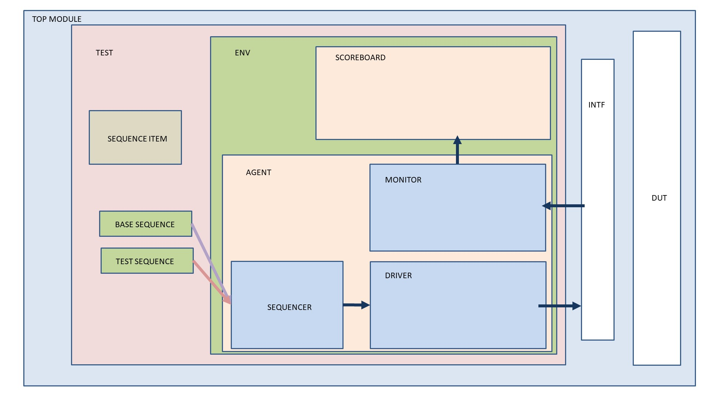
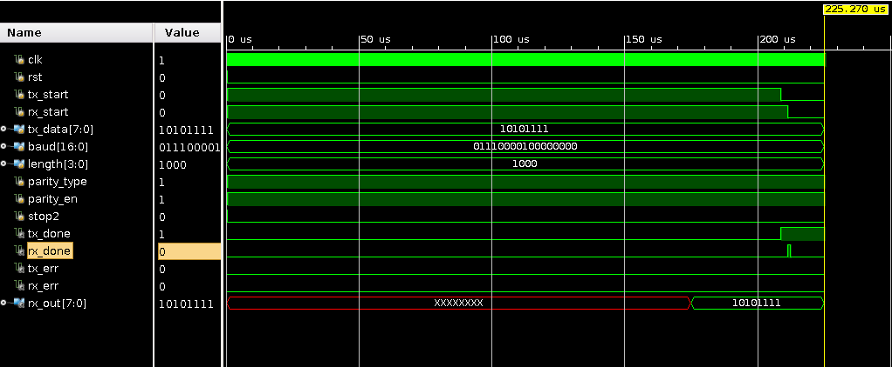

### UART SPEC
- Inputs:
    - `clk` 
    - `rst`
    - `baud` - required baud rate on the input bus of size 17 bits
    - `tx_start`
    - `rx_start`
    - `tx_data`
    - `baud`
    - `length`
    - `parity_type` 
    - `parity_en` 
    - `stop2` 
    
- Output:
    - `tx_done`
    - `tx_err`
    - `rx_done`
    - `rx_err`
    - `rx_out`

Assumptions: 
- The base clock frequency is considered to be 50MHz and baud rate is lower than this value.
- We consider the baud rates 4800, 9600, 14400, 19200, 38400 and 57600.

A standard practice for asynchronous communication is to oversample the signal at 16 times the BAUD rate. This is done to detect the first drop quickly and synchronize with the transmitting clock.

Sampling in the middle of the bit period is not essential, but it is optimal, because sampling closer to the beginning or end of the bit period makes the system less robust against clock-frequency differences between receiver and transmitter.

### Architecture

### Block Diagram

### Output

[Link for project on EDA Playground](https://edaplayground.com/x/cRrp)

[More about the sampling scheme](https://www.allaboutcircuits.com/technical-articles/back-to-basics-the-universal-asynchronous-receiver-transmitter-uart/)

### CAUTION:
Don't run this simulation using Synopsys VCS 2021.09. There's a weird bug in the compiler where it tends to call the `rec_data` state for more than required number of ticks hence dumping garbage into `rx_data`.

MWE exists at https://edaplayground.com/x/HyXM.
All the other simulators work well. Even a 2014 build of iverilog gives the right output. 

Well done Synopsys! 